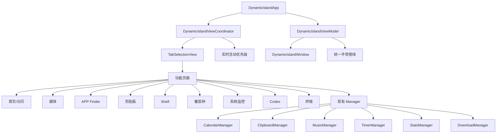

# 灵屿 Lingyu 开发文档

> 项目状态：个人开发版
>
> 文档版本：v0.1
>
> 更新时间：2026-07-31

## 1. 项目定位

灵屿 Lingyu 是一个面向 macOS 刘海屏的个人效率工具。它把常用的系统状态、媒体控制、应用启动、剪贴板、文件暂存、番茄钟和 Codex 状态集中到顶部刘海区域。

项目基于 Atoll 的 GPLv3 代码继续开发。灵屿的目标不是重复实现所有已有功能，而是在保留 Atoll 成熟能力的基础上，重点改进以下体验：

- 像 NookX 一样紧凑、清晰、可配置。
- 顶部刘海交互稳定，不误触、不抢手势。
- 页面、活动和用户偏好能够正确记忆。
- 功能之间入口统一，不出现重复卡片和空页面。
- 个人数据尽量保存在本机，不依赖自建服务器。

## 2. 当前基线

### 2.1 已有能力

- 项目名称和开发安装产物统一为 `灵屿 Lingyu` / `Lingyu.app`。
- 顶部标签支持横向滚动、长按拖动排序和顺序持久化。
- APP Finder 支持应用扫描、搜索、最近使用、收藏、键盘选择和回车启动。
- 页面包含首页、快捷控制、媒体、APP、Codex、番茄钟、系统监控、剪贴板、Shelf、终端等模块。
- 剪贴板支持文本和图片历史，图片支持重新复制和拖放。
- 媒体、下载、番茄钟和 Shelf 有实时活动展示。
- 系统监控支持 CPU、内存、GPU、网络、磁盘指标选择。
- Lingyu 可通过 `构建并运行 灵屿.command` 编译、安装和启动。
- GitHub 主分支为 `main`，远程仓库为 `ColonelG-yue/Lingyu`。

### 2.2 最近已修复

- 悬停时不再额外安装全局/本地鼠标点击监听，减少误触展开。
- 横向手势改为单一 AppKit 滚动事件管线，避免 SwiftUI `DragGesture` 和 `NSEvent` 竞争。
- 关闭刘海时不再强制把页面重置到首页或 Shelf。
- APP Finder 作为临时页面，不覆盖进入前的页面记忆。
- 快捷控制中的“清空剪贴板”已删除。
- 页面记忆已迁移到 `lingyu.lastNotchView`，首次启动会兼容读取旧的 Atoll 键值；APP Finder 不会成为启动后的默认页面。
- 顶部标签在未选中时保留原有 UI 测试标识，选中后暴露稳定的 `.selected` 标识，便于回归测试确认实际选中状态。
- 启动番茄钟、选择番茄钟预设、拖入 Shelf 和悬停自动聚焦番茄钟时，都会记录为最近主动使用的实时活动，避免仍停留在旧活动优先级。
- 实时活动现在使用“最近主动使用优先、默认顺序回退”的解析器；可通过 `--lingyu-gesture-diagnostics` 启用触控板诊断日志。
- 活动优先级已有生产代码驱动的回归夹具，可用 `--uitesting-activity-priority` 验证最近使用、回退和空活动场景。
- 手势提交规则已集中到 `PanGesturePolicy`：切页必须是水平手势；纵向滚动即使速度较高也不会触发标签切换。可通过 `--uitesting-gesture-policy` 验证方向、速度和距离边界。
- 顶部标签改为一次拖动直接排序，不再要求先长按进入编辑态；拖动期间会暂时抑制自动收起，成功落位后保存顺序并给出一次触控板反馈。
- 剪贴板历史页不再把整个内容区域标记为横向手势禁区；纵向滚动仍由列表处理，横向滑动可继续切换页面。

最近提交：`74dfceb ci: remove upstream organization mirror`

### 2.3 已知问题

- 页面记忆在不同活动和 Shelf 默认页之间仍需要统一验证；跨重启的快捷控制页回归测试已加入。
- 终端内部纵向滚动和顶部横向切页仍需要真机触控板测试；生产代码夹具已覆盖方向误判和短拖误触发。
- 番茄钟虽然仍在顶部标签列表中，但在标签很多时可发现性不够好。
- UI 测试已覆盖启动、刘海、核心标签/快捷控制以及跨重启页面记忆；测试环境仍不替代真实触控板验证。
- 首次启动界面和设置页面仍有 Atoll 原始结构及部分旧文案。
- macOS 日历变化后的实时刷新尚未形成稳定闭环。
- 系统状态提醒、喝水/久坐/睡眠提醒还没有完整的配置、通知和记录链路。
- Forest 式番茄钟成长奖励还未实现。
- Codex 当前以本地任务和用量信息为主，免费模型接入尚未实现。

## 3. 产品范围

### 3.1 本阶段目标

本阶段以“稳定使用”为目标，不继续无上限增加入口。优先完成：

1. 顶部导航、手势和页面记忆稳定。
2. 番茄钟入口、活动优先级和排序可理解、可操作。
3. 日历同步和剪贴板图片使用闭环。
4. Lingyu 风格的首次启动和设置中心。
5. 系统状态与日常关怀提醒。
6. Forest 式番茄钟奖励。
7. Codex 专属任务面板和订阅提醒。

### 3.2 明确不做

- 不直接读取 iPhone 或 Apple Watch 私有数据；日历通过 macOS 日历同步获得。
- 不绕过 macOS 辅助功能、日历、摄像头或文件权限。
- 不重复开发 Atoll 已有的媒体、Shelf、计时器、剪贴板管理器和终端基础能力。
- 不在没有用户明确配置时接管第三方 AI 账号、Cookie、Token 或支付操作。
- 不把 NookX 的私有服务器或付费功能直接复制到本项目。

## 4. 模块架构



### 4.1 状态分层原则

页面状态、临时页面状态和实时活动状态必须分开：

| 状态 | 例子 | 保存方式 |
| --- | --- | --- |
| 普通页面 | 系统监控、剪贴板、媒体 | `lastNotchView` |
| 临时页面 | APP Finder、搜索弹层 | 只保存在内存，不覆盖普通页面 |
| 实时活动 | 音乐、下载、番茄钟、Shelf | 当前会话优先级，不覆盖普通页面 |
| 用户配置 | 标签顺序、提醒开关、主题 | `Defaults` / `@AppStorage` |
| 历史数据 | 剪贴板、专注记录、喝水记录 | 本地持久化，按需读取 |

## 5. 开发路线

### Milestone 0：基线和回归测试

目标：每次修改前后都能确认 Lingyu 能启动。

- 修复 UI 测试中的刘海元素定位。
- 将用户可见的测试标识从 Atoll 逐步统一为 Lingyu；保留协议和上游代码中的 Atoll 名称。
- 增加页面记忆、番茄钟入口、快捷控制和权限状态测试。
- 记录一次普通使用状态下的内存和 CPU 基线。

验收：Debug 编译通过；启动测试通过；核心页面测试可重复运行。

### Milestone 1：导航和手势稳定

目标：解决“误触、滑不动、回到错误页面”。

- 统一横向手势识别入口。
- 明确横向/纵向意图，斜向滚动不切页。
- 终端允许纵向滚动，同时保留明确横向切页。
- 顶部标签在切换后自动滚动到可见区域。
- 番茄钟始终存在于可用标签列表；被遮挡时可通过横向滚动访问。
- 直接拖动标签调整顺序，拖动期间保持展开，落位后立即保存。
- 普通页面、APP Finder 和实时活动使用分离的状态记录。
- 键盘切换不使用多余的页面动画；鼠标点击保留短反馈动画。

验收：连续打开/关闭 20 次不会回到错误页面；终端上下滚动不触发切页；左右滑动一次最多切换一页；不存在悬停自动点击。

### Milestone 2：功能闭环

目标：消除空页面和重复入口。

- 日历监听 macOS 日历变化并刷新界面。
- EventKit 变化通知会绕过短期缓存；应用重新回到前台时重新读取权限与当前日程，并以 60 秒低频轮询兜底 iCloud 同步遗漏的通知。
- 日历和天气采用紧凑卡片，点击后进入详细页面。
- 剪贴板图片支持拖到 Codex、ChatGPT、浏览器上传框。
- 媒体无播放内容时显示明确空状态和可执行动作。
- Shelf 无文件时显示拖入、从下载目录选择和最近项目入口。
- 快捷控制只保留直接操作，不重复放置模块跳转卡片。
- 音乐、下载、番茄钟和 Shelf 采用统一的最近主动操作优先级。

验收：每个入口都能产生明确结果；无权限、无内容和文件失效时都有中文说明；活动切换不会覆盖用户当前普通页面。

### Milestone 3：Lingyu 设置中心和首次启动

目标：从 Atoll 原始设置结构过渡为 Lingyu 的统一设置。

设置分类建议：

- 通用：开机启动、刘海开关、语言、菜单栏图标。
- 外观：浅色/暗色、圆角、宽度、高度、字体、动画速度。
- 交互：悬停延迟、点击展开、横向手势、长按排序、触控板反馈。
- 页面：顶部标签显示和顺序、默认页面、实时活动优先级。
- 系统监控：指标选择、采样间隔、关闭后是否停止采样。
- 提醒：系统状态、喝水、久坐、睡眠、Codex 订阅。
- 权限：辅助功能、日历、提醒事项、摄像头、文件夹权限。
- 关于：版本、GPLv3、上游 Atoll、日志导出。

首次启动流程：

```text
欢迎页 → 选择工作模式 → 权限状态 → 选择顶部功能 → 完成
```

验收：首次启动不再出现用户可见的旧 Atoll 品牌；设置窗口可缩小、退出和重新打开首次引导；权限状态能区分已授权、待授权和被拒绝。

### Milestone 4：提醒和番茄钟成长

系统提醒：

- CPU/内存持续高占用。
- 磁盘空间不足。
- 网络断开或恢复。

日常关怀默认值：

- 喝水：每 30 分钟。
- 久坐：每 30 分钟。
- 睡前预提醒：21:30。
- 睡眠提醒：22:30。

Forest 式番茄钟：

- 完成一个番茄钟获得一棵植物。
- 连续完成形成森林。
- 中途退出记录为未完成，不强制惩罚。
- 允许查看今日、七日和累计专注统计。
- 动画只在完成、连续达成和每日总结时出现，普通倒计时不使用过度动画。

验收：提醒可单独开关；关闭应用后仍能按配置触发；重复通知有节流；专注记录重启后不丢失。

### Milestone 5：Codex 专属面板

- 当前任务、等待审批、等待提问、执行中、完成、失败状态。
- 最近任务列表和跳转 Codex。
- 本地 Token/用量概览。
- 每月 30 日续费提醒，默认提前一周提示。
- 用户可以标记“本月已充值”，标记后推迟到下月。
- 后续再考虑 Ollama 和 OpenAI-compatible API，不阻塞本地 Codex 面板。

## 6. 交互和动画规范

- 高频操作不做明显动画：键盘切换、列表方向键、重复打开快捷入口。
- 点击反馈约 100–160ms，标签切换约 180–240ms，刘海展开/收起约 250–350ms。
- 进入动画使用 `opacity + scale(0.97)`，不从 `scale(0)` 出现。
- 拖动时直接跟随手势，不在每个 `onChanged` 中叠加动画。
- 释放拖动后使用低回弹 spring，避免“弹一下又缩回去”。
- 动画只优先改变 `transform`、`opacity` 和必要的 `blur`，避免频繁同时修改宽高、内边距和布局。
- `Reduce Motion` 开启时降低回弹和模糊，保留状态反馈。
- 悬停只表示意图，不等于点击；自动展开必须有延迟和可关闭设置。

## 7. 测试策略

### 7.1 每次提交前

```bash
DEVELOPER_DIR=/Applications/Xcode.app/Contents/Developer \
xcodebuild -quiet \
  -project DynamicIsland.xcodeproj \
  -scheme DynamicIsland \
  -configuration Debug \
  -destination 'platform=macOS' \
  -derivedDataPath .build/DerivedData \
  CODE_SIGNING_ALLOWED=NO build
```

### 7.2 本机安装测试

```bash
./构建并运行\ 灵屿.command
```

手动检查：

1. 悬停刘海不会产生点击或触控板反馈。
2. 点击刘海仍可展开。
3. 双指左右滑动切换页面。
4. 终端上下滚动和横向切页互不影响。
5. 番茄钟能通过顶部滚动访问。
6. 一次拖动标签即可排序，拖动时刘海不收起。
7. 关闭后重新展开回到上次普通页面。
8. 音乐、下载、番茄钟同时运行时，最近主动使用的活动优先。

### 7.3 测试分层

- 单元测试：页面状态、活动优先级、提醒时间计算、排序持久化。
- UI 测试：应用启动、核心标签、快捷控制、空状态、设置入口。
- 手动设备测试：触控板手势、刘海遮挡、媒体控制、辅助功能权限。
- 性能测试：APP Finder 扫描、系统监控采样、剪贴板图片拖放、长时间运行。

## 8. Git 和版本流程

### 8.1 分支

- `main`：可运行的稳定主线。
- `codex/feature-*`：新功能。
- `codex/fix-*`：缺陷修复。
- `codex/refactor-*`：内部重构。

当前个人开发也可以直接在 `main` 上提交小修复，但涉及多个文件或行为变化时优先使用分支。

### 8.2 提交格式

```text
feat: add calendar refresh observer
fix: preserve previous notch page
refactor: centralize activity priority
test: cover timer tab navigation
docs: update development workflow
```

每次提交只解决一个明确问题。提交前必须说明：改了什么、为什么改、如何验证。

### 8.3 完成标准 Definition of Done

一个功能只有同时满足以下条件，才算完成：

- 代码进入正确模块，没有重复实现已有 Manager。
- 正常路径、空状态、权限拒绝和错误路径都有处理。
- 触控板、鼠标、键盘至少覆盖与功能相关的输入方式。
- 页面记忆和重启行为符合预期。
- Debug 编译通过。
- 相关单元/UI 测试通过，无法自动化的部分有手动测试记录。
- 用户可见文案为 Lingyu 中文界面，保留 GPLv3 和上游归属。
- 提交信息清晰并推送到 GitHub。

## 9. 权限和数据原则

- 辅助功能只用于读取前台应用、窗口交互和系统状态；不得扩大用途。
- 日历权限只读取显示所需的事件信息。
- 剪贴板内容和图片默认本地保存，不上传服务器。
- Codex 会话、用量和充值标记保存在本机。
- 日志导出前明确告知用户可能包含哪些路径和错误信息。
- 不读取 Cookie、API Token、支付信息或第三方账号隐私数据。

## 10. 下一张开发卡片

当前已完成本卡片中的 UI 回归验证：`AtollNotch` 测试改为通用可访问性树查询，避免把 SwiftUI 布局容器误判为图片；快捷控制、番茄钟、核心标签和跨重启页面记忆断言均已通过。完整 UI 测试结果：4 个测试、0 个失败。

剩余工作进入 **Milestone 1 的状态可测试化和真实设备验证**：

1. 在真实触控板上验证终端上下滚动与横向切页。
2. 确认番茄钟、APP Finder 和 Shelf 的长按排序/临时页面行为。

完成这张卡片后，再进入日历同步和 Lingyu 设置中心，不同时开发多个高风险交互模块。
